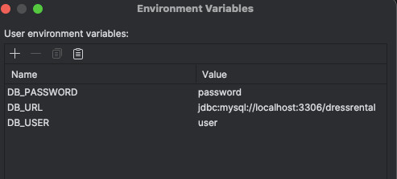

# Hafta-6-Examples-Day1-DressRentalApp

- Docker Desktop Üzerinden MySQL’e Erişim ve Tabloları Görüntüleme 
- Docker Desktop'ı Aç
- Docker Desktop'ı başlat ve sol menüden "Containers" sekmesine git.
- mysql adlı konteyneri bul (örneğin yourproject_mysql_1 gibi).
- Sağ tarafında "..." menüsüne tıkla ve Open in Terminal seçeneğini seç.

- Terminal açıldığında şu komutu yaz: mysql -u user -p dressrental
- enter password bilgisine password yaz.

- Veritabanı ve Tabloları Görüntüle
- SHOW DATABASES; USE dressrental; SHOW TABLES;

- Herhangi bir tablonun yapısını görmek için: DESCRIBE users;

- env bilgileri
- 

